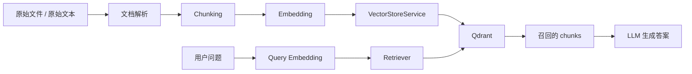

# Qdrant 架构说明

本文档用于说明当前项目中 `Qdrant` 的定位、核心概念、与传统数据库的类比关系，以及文档如何经过 `chunk -> embedding -> vector upsert` 写入向量库。

本文档重点回答 4 个问题：

- `Qdrant` 在本项目里到底承担什么角色
- `collection / point / payload / vector / filter` 分别是什么
- 当前项目中的文档是如何切分并写入 `Qdrant` 的
- 后续如果要调整切分策略、索引版本或切换部署方式，应该改哪里

---

## 1. 在本项目中的定位

当前项目已经把“知识库与检索层”拆成了几层明确的职责：

- 文档解析：负责把原始文件还原成标准化文本和位置信息
- Chunking：负责把长文本切成可检索的片段
- Embedding：负责把片段文本转成向量
- Vector Store：负责管理集合、写入向量、执行相似度查询、按文档删除
- Retrieval / RAG：负责组织 query embedding、filter、top_k，并将结果交给 LLM

`Qdrant` 在这里扮演的是 **向量存储后端**，而不是完整的知识库业务系统。

当前实际代码落点如下：

- 向量库服务层：`app/runtime/retrieval/vector_store/service.py`
- Qdrant 适配器：`app/integrations/vector_stores/qdrant_adapter.py`
- RAG 入库编排：`app/modules/knowledge_center/services/knowledge_index_service.py`
- 文档切块服务：`app/modules/knowledge_center/services/document_chunk_service.py`
- Chunking 核心实现：`app/runtime/retrieval/chunking/`

可以把当前架构理解为：



---

## 2. 用传统数据库类比理解 Qdrant

先把 `Qdrant` 粗略理解成“专门做向量检索的数据库”。

| 关系型数据库 | Qdrant | 本项目中的含义 |
|---|---|---|
| 数据库实例 | Qdrant 服务 / 本地 Qdrant 实例 | 你现在本地通常是一个 `qdrant local` 实例 |
| 表 | `collection` | 一组一起检索、一起管理 schema 的向量数据 |
| 行 | `point` | 一个 chunk 的一条向量记录 |
| 主键 | `point id` | 当前实现里是 `uuid5(chunk_id)` |
| 普通列 | `payload` | `document_id`、`chunk_index`、`title_path` 等元数据 |
| 特殊索引列 | `vector` | 该 chunk 的 embedding |
| `WHERE` | `filter` | 按 `tenant_id / document_id / knowledge_base_id` 过滤 |
| `ORDER BY ... LIMIT k` | 相似度查询 `top_k` | 找最接近 query 的若干 chunk |
| 二级索引 | payload index | 给常用过滤字段建索引以提升查询性能 |

如果只记一句话：

> 在本项目里，`Qdrant collection` 可以理解成“某个知识库某个索引版本的一张向量表”。

---

## 3. Qdrant 核心概念

### 3.1 collection

`collection` 是 Qdrant 里最核心的逻辑隔离单元，最接近“表 + 向量索引空间”的组合。

它不只是一个普通表名，还同时约束：

- 这组数据的向量维度必须一致
- 这组数据的距离度量必须一致
- 检索默认发生在这个 collection 内

在本项目里，当前采用：

- 一个 `knowledge_base_id`
- 一个 `index_name`
- 一个 `index_version`

对应一个物理 `collection`。

这样做的好处是：

- 索引版本隔离清晰
- 切换版本简单
- 重建索引时不需要和旧 chunk 混用
- 删除和回滚边界清楚

代价是 collection 数量会更多，不是所有数据都堆在一个大 collection 里。

### 3.2 point

`point` 是 Qdrant 中的一条记录，包含：

- `id`
- `vector`
- `payload`

在本项目里，一个 `point` 基本等于一个 `chunk`。

### 3.3 vector

`vector` 就是 embedding 结果，是相似度检索的核心字段。

当前项目里：

- 同一个 collection 内所有向量维度必须一致
- 默认距离度量由 `VECTOR_STORE_DEFAULT_METRIC` 控制
- 当前默认是 `cosine`

### 3.4 payload

`payload` 是附加在 point 上的结构化数据，类似普通数据库中的列或 JSON 字段。

当前项目把以下信息写入 payload：

- `tenant_id`
- `app_id`
- `knowledge_base_id`
- `index_name`
- `index_version`
- `document_id`
- `chunk_id`
- `text`
- `chunk_index`
- `title_path`
- `page_range`
- `source_block_ids`
- `source_positions`
- `source_position`
- `policy_name`
- `file_name`
- `file_type`
- `source_type`

### 3.5 filter

`filter` 相当于 SQL 的 `WHERE` 条件。

当前项目主要用它做：

- 多租户隔离
- 应用隔离
- 知识库隔离
- 文档删除
- 按特定文档范围查询

比如删除文档时，本质上就是按 `document_id` 找到对应 points 再删除。

### 3.6 payload index

`payload index` 可以理解成普通数据库里的二级索引。

当前适配器会尝试为这些常用过滤字段建立 keyword index：

- `tenant_id`
- `app_id`
- `knowledge_base_id`
- `index_name`
- `index_version`
- `document_id`
- `chunk_id`
- `file_name`
- `file_type`
- `source_type`
- `policy_name`

并为 `chunk_index` 建整数索引。

需要注意的是：

- 远程 Qdrant 模式下会主动建这些索引
- 本地 `qdrant local` 模式下当前实现不会额外建 payload index

### 3.7 named vectors

`named vectors` 可以理解成“一条记录同时有多个向量列”，例如：

- `title_vector`
- `body_vector`

当前项目还没有使用这个能力，仍然是单向量模式。

### 3.8 shard / replica / segment

这几个概念更偏底层和分布式：

- `segment`：内部存储分段
- `shard`：分片
- `replica`：副本

对当前本地开发和最小 RAG 实现来说，最需要理解的仍然是：

- `collection`
- `point`
- `payload`
- `vector`
- `filter`

---

## 4. 本项目当前如何使用 Qdrant

### 4.1 当前支持的两种模式

当前项目 `VectorStoreService` 已经支持两种 Qdrant 使用模式：

1. 本地嵌入式模式

```env
VECTOR_STORE_PROVIDER=qdrant
QDRANT_LOCAL_MODE=true
QDRANT_LOCAL_PATH=data/qdrant_local
```

2. 远程服务模式

```env
VECTOR_STORE_PROVIDER=qdrant
QDRANT_LOCAL_MODE=false
QDRANT_URL=http://localhost:6333
QDRANT_API_KEY=
```

当前默认配置定义在 `app/core/config.py`。

其中：

- `QDRANT_LOCAL_MODE=true` 时走 `QdrantClient(path=...)`
- `QDRANT_LOCAL_MODE=false` 时走 `QdrantClient(url=...)`

本地模式适合：

- 本地开发
- 单元测试
- 快速 smoke 验证

但不适合：

- 多进程同时访问同一数据目录
- 正式生产部署

### 4.2 collection 命名规则

当前 collection 由 `VectorStoreService.build_collection_name()` 统一生成，规则为：

```text
{prefix}{tenant_id}__{app_id}__{knowledge_base_id}__{index_name}__{index_version}
```

默认前缀：

```text
kb_
```

例如：

```text
kb_demo-tenant__demo-app__kb-demo__main__v1
```

命名还有两条实现细节：

- 非字母数字、下划线、连字符的字符会被替换成 `_`
- 超过 120 字符时会截断并追加哈希摘要

这意味着 collection 名称不建议由业务侧手工拼接，应该统一交给向量库服务层生成。

### 4.3 point 结构映射

当前写入 Qdrant 时，point 结构大致如下：

```json
{
  "id": "uuid5(chunk_id)",
  "vector": [0.12, -0.43, 0.98],
  "payload": {
    "chunk_id": "chunk-001",
    "document_id": "doc-001",
    "text": "这里是 chunk 文本",
    "tenant_id": "demo-tenant",
    "app_id": "demo-app",
    "knowledge_base_id": "kb-demo",
    "index_name": "main",
    "index_version": "v1",
    "chunk_index": 0,
    "title_path": ["第一章 总则"],
    "page_range": [1, 2],
    "source_block_ids": ["page:1:segment:1"],
    "source_positions": [
      {
        "page_no": 1,
        "start_offset": 0,
        "end_offset": 180
      }
    ],
    "source_position": {
      "page_no": 1,
      "start_offset": 0,
      "end_offset": 180
    },
    "policy_name": "default",
    "file_name": "manual.docx",
    "file_type": "docx",
    "source_type": "file_path"
  }
}
```

需要注意：

- point 的主键不是直接使用 `chunk_id`
- 当前实现使用 `uuid5(chunk_id)` 作为 Qdrant `id`
- 但业务语义上仍然以 `chunk_id` 作为稳定 chunk 身份

### 4.4 查询与删除

当前支持的主要操作有：

- `ensure_collection`
- `upsert_records`
- `query_vectors`
- `delete_records`

其中：

- 查询 = `query_vector + filters + top_k`
- 删除 = 按 `chunk_ids` 或 `document_ids` 删除

当前 `query_vectors` 会返回：

- `chunk_id`
- `document_id`
- `score`
- `text`
- `metadata`

这正是后面 `Retriever` 和 `SimpleRAGService` 继续使用的数据基础。

---

## 5. 文档如何进入向量库

当前项目中，文档入库不是直接把文件扔给 Qdrant，而是经过一条编排链路：

```mermaid
flowchart LR
    A["source_type=file_path/url/base64"] --> B["DocumentParseService.parse"]
    B --> C["DocumentChunkService.parse_and_chunk"]
    C --> D["ChunkingService"]
    D --> E["EmbeddingGatewayService.embed"]
    E --> F["VectorStoreService.upsert_records"]
    F --> G["Qdrant collection"]
```



对应主入口：

- 文件入库：`KnowledgeIndexService.ingest_source()`
- 纯文本入库：`KnowledgeIndexService.ingest_raw_text()`

### 5.1 入库步骤

#### 第 1 步：解析文档

`DocumentChunkService.parse_and_chunk()` 会先调用文档解析服务，把文件转换为：

- `parsed_document.text`
- `parsed_document.pages`
- `parsed_document.locations`

解析层负责把原始文件转成“可切块的文本与位置信息”。

#### 第 2 步：切块

切块由 `ChunkingService` 完成，核心实现是：

- `DocumentChunker`
- `TextChunker`

当前切块不是多算法路由，而是 **一套标题感知 + 段落感知 + 滑窗切分的统一算法**，再叠加不同参数策略。

#### 第 3 步：生成 embedding

`KnowledgeIndexService` 会把每个 chunk 文本提交给 `EmbeddingGatewayService.embed()`，得到：

- `chunk_id -> vector`

#### 第 4 步：写入 Qdrant

最后将 chunk 文本、向量和元数据组装成 `VectorRecord`，交给 `VectorStoreService.upsert_records()` 统一写入 Qdrant。

---

## 6. 当前 chunking 规则

### 6.1 默认参数

如果 `.env` 没有覆盖，当前默认策略来自 `ChunkingSettings`：

```env
CHUNKING_DEFAULT_POLICY_NAME=default
CHUNKING_MAX_CHARS=1200
CHUNKING_OVERLAP_CHARS=150
CHUNKING_SPLIT_BY_HEADING=true
CHUNKING_SPLIT_BY_PARAGRAPH=true
CHUNKING_KEEP_HEADING_PREFIX=true
```

这些默认值定义在 `app/core/config.py`。

### 6.2 当前切块思路

当前算法的核心逻辑是：

1. 先从解析结果中构造 `SourceUnit`
2. 尽量保留 `page_no / row_index / block_id / start_offset / end_offset`
3. 识别标题并维护 `title_path`
4. 按标题边界切分不同主题
5. 按段落或行继续拆分
6. 如果单段太长，再做滑窗切分
7. 生成带 overlap 的 chunk

### 6.3 标题识别

当前支持这些标题模式：

- Markdown 标题：`# 标题`
- 数字标题：`1.`、`1.2`、`1.2.3`
- 中文标题：`第一章`、`第一节`、`第一部分`

如果识别到标题，并且开启了 `split_by_heading=true`，则 chunk 会按标题路径分组。

### 6.4 段落与滑窗

当前段落切分逻辑：

- 优先按空行分段
- 如果空行分不出来，再按行切分
- 如果某一段仍然超过 `max_chars`，就按滑窗切开

滑窗切分的步长近似为：

```text
max_chars - overlap_chars
```

### 6.5 overlap 规则

`overlap` 不是简单按字符回带，而是：

- 仅从当前 chunk 尾部往前取若干 `PreparedUnit`
- 且只在同一 `title_path` 下回带

这样做的好处是：

- 尽量避免跨章节污染上下文
- 保留相邻 chunk 之间的连续性

### 6.6 chunk 输出包含什么

当前每个 chunk 会包含：

- `chunk_id`
- `document_id`
- `chunk_index`
- `text`
- `title_path`
- `page_range`
- `source_block_ids`
- `source_positions`
- `policy_name`
- `metadata`

其中 `chunk_id` 当前由以下内容稳定生成：

```text
document_id + policy_name + chunk_index + text
```

这意味着：

- 切分策略变了，`chunk_id` 也可能变化
- 文本内容变了，`chunk_id` 也会变化

---

## 7. 如何修改当前行为

### 7.1 只改部署方式

如果你只是要切换 Qdrant 连接方式，改 `.env` 就够了。

本地模式：

```env
VECTOR_STORE_PROVIDER=qdrant
QDRANT_LOCAL_MODE=true
QDRANT_LOCAL_PATH=data/qdrant_local
```

远程模式：

```env
VECTOR_STORE_PROVIDER=qdrant
QDRANT_LOCAL_MODE=false
QDRANT_URL=http://your-qdrant-host:6333
QDRANT_API_KEY=
QDRANT_PREFER_GRPC=false
QDRANT_HTTPS=false
```

### 7.2 只改切块参数

如果你只想调整 chunk 粒度，不需要改代码，先改这些环境变量：

```env
CHUNKING_MAX_CHARS=800
CHUNKING_OVERLAP_CHARS=100
CHUNKING_SPLIT_BY_HEADING=true
CHUNKING_SPLIT_BY_PARAGRAPH=true
CHUNKING_KEEP_HEADING_PREFIX=true
```

### 7.3 单次入库传不同策略

如果你只想对某一次文档入库使用不同切块参数，可以在请求里传 `ChunkingPolicyConfig`。

示例：

```python
from app.modules.knowledge_center import KnowledgeIndexSourceRequest
from app.runtime.retrieval.chunking import ChunkingPolicyConfig

request = KnowledgeIndexSourceRequest(
    tenant_id="demo-tenant",
    app_id="demo-app",
    knowledge_base_id="kb-demo",
    document_id="doc-001",
    source_type="file_path",
    source_value=r"D:\docs\sample.docx",
    policy=ChunkingPolicyConfig(
        policy_name="small_chunks",
        max_chars=800,
        overlap_chars=100,
        split_by_heading=True,
        split_by_paragraph=True,
        keep_heading_prefix=True,
    ),
)
```

### 7.4 要改算法本身时改哪里

如果不是改参数，而是改“算法行为”，可以按目标定位文件：

- 改标题识别规则：`app/runtime/retrieval/chunking/text_chunker.py`
- 改段落切分：`app/runtime/retrieval/chunking/text_chunker.py`
- 改长段滑窗切分：`app/runtime/retrieval/chunking/text_chunker.py`
- 改解析结果转 `SourceUnit` 的方式：`app/runtime/retrieval/chunking/document_chunker.py`
- 改默认策略解析：`app/runtime/retrieval/chunking/policies.py`
- 改写入 Qdrant 的 payload 结构：`app/modules/knowledge_center/services/knowledge_index_service.py`
- 改 Qdrant point id、payload index、filter 映射：`app/integrations/vector_stores/qdrant_adapter.py`
- 改 collection 命名策略：`app/runtime/retrieval/vector_store/service.py`

---

## 8. 修改策略时要注意的事

### 8.1 改切分策略后不要直接无脑重跑同一索引版本

因为当前：

- `chunk_id` 和 `policy_name / chunk_index / text` 有关
- collection 又是按 `knowledge_base_id + index_name + index_version` 隔离

所以一旦切块策略变了，同一文档很可能会产生新的 chunk 集合。

正确做法通常是二选一：

1. 先删除旧文档，再重新入库
2. 直接切一个新的 `index_version`

如果是正式环境，更推荐第二种。

### 8.2 本地 Qdrant 目录不要被多个进程同时占用

`QDRANT_LOCAL_MODE=true` 时，底层是本地数据目录模式。

这意味着：

- 一个路径通常只适合一个活跃 client / 进程占用
- 多个进程并发访问同一个 `QDRANT_LOCAL_PATH` 可能报锁冲突

所以开发环境适合：

- 单进程调试
- 脚本 smoke
- 单测

如果要多进程、多实例并发，应该切回远程 Qdrant 服务模式。

### 8.3 collection 不等于 document

当前 collection 的粒度是：

- 知识库
- 索引名
- 索引版本

而不是“一篇文档一个 collection”。

文档级管理依赖的是 payload 里的：

- `document_id`
- `chunk_id`

不是靠单独 collection 来隔离每篇文档。

---

## 9. 后续可演进方向

当前实现已经足够支撑最小 RAG，但还可以继续演进：

### 9.1 多 chunk 方法

当前只有“一套算法 + 多参数策略”，后续可以扩展成真正的多方法路由：

- `heading_aware`
- `fixed_window`
- `page_based`
- `table_row_based`
- `semantic_chunking`

### 9.2 多向量字段

后续可以考虑利用 `named vectors` 支持：

- 标题向量
- 正文向量
- 摘要向量

### 9.3 检索增强

在当前纯向量召回基础上，可以继续增加：

- hybrid retrieval
- rerank
- query rewrite
- citation trace back

### 9.4 RAG 与 ingest trace 互链

当前 LangSmith 中：

- `knowledge.ingest` 在 ingest project
- `rag.answer` 在 rag project

两者已经可以通过业务主键对应，但还没有“直接互链”。

后续可以考虑把 `knowledge_index_trace_id` 写入 chunk metadata，并在检索结果中回传，形成更直接的追踪链路。

---

## 10. 结论

在当前项目里，可以把 `Qdrant` 简单理解为：

- 一个用于保存 chunk 向量和元数据的专用向量数据库
- 一个按 `knowledge_base + index_name + index_version` 管理物理隔离的存储层
- 一个被 `KnowledgeIndexService` 和 `Retriever` 共同复用的统一检索基础设施

而不是：

- 文档解析器
- embedding 生成器
- 业务知识库管理系统
- 完整的 RAG 编排层

如果后续只做最小 RAG，当前这套落地已经足够：

- 文档解析
- chunking
- embedding
- Qdrant 存储
- retrieval
- LLM 生成

全部已经串成闭环。

---

## 11. 参考资料

- Qdrant Collections: [https://qdrant.tech/documentation/concepts/collections/](https://qdrant.tech/documentation/concepts/collections/)
- Qdrant Points: [https://qdrant.tech/documentation/concepts/points/](https://qdrant.tech/documentation/concepts/points/)
- Qdrant Payload: [https://qdrant.tech/documentation/concepts/payload/](https://qdrant.tech/documentation/concepts/payload/)
- Qdrant Vectors: [https://qdrant.tech/documentation/concepts/vectors/](https://qdrant.tech/documentation/concepts/vectors/)
