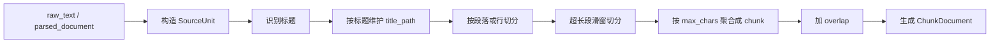

# 当前 Chunk 模式说明

本文档用于说明当前项目里 `RAG` 所使用的 `chunk` 模式、实际切分流程、默认参数和修改入口。

本文档重点回答以下问题：

- 当前项目的 chunk 是哪一种模式
- 文本和文件分别是如何进入 chunk 流程的
- 当前标题、段落、滑窗是怎么配合工作的
- 一个 chunk 最终包含哪些字段
- 如果要调整 chunk 粒度或策略，应该改哪里

本文档描述的是当前代码已经落地的实现，不讨论未来可能支持的多 chunk 算法或语义切分方案。

---

## 1. 总体结论

当前项目的 chunk 模式不是：

- 纯固定窗口切分
- 纯语义切分
- 多算法路由

而是：

> 一套“标题感知 + 段落感知 + 超长文本滑窗切分”的统一 chunk 策略。

简单理解就是：

1. 优先识别文档结构
2. 尽量按标题和段落边界切
3. 如果单段仍然太长，再用滑窗补切
4. 相邻 chunk 之间再加适度 overlap

当前这套模式更偏向中文制度文档、说明文档、知识库文档，而不是追求最激进的语义 chunk。

---

## 2. 代码入口

当前 chunk 主链路如下：

```text
DocumentChunkService
-> ChunkingService
-> DocumentChunker / TextChunker
-> ChunkDocument 列表
```

对应代码入口：

- 文档切块服务：`app/modules/knowledge_center/services/document_chunk_service.py`
- chunking 调度层：`app/runtime/retrieval/chunking/service.py`
- 文档切块器：`app/runtime/retrieval/chunking/document_chunker.py`
- 文本切块器：`app/runtime/retrieval/chunking/text_chunker.py`
- chunk schema：`app/runtime/retrieval/chunking/schemas.py`
- 默认策略解析：`app/runtime/retrieval/chunking/policies.py`

---

## 3. 文件和文本分别怎么走

### 3.1 原始文本

如果直接传原始文本，调用的是：

- `DocumentChunkService.chunk_raw_text()`

流程是：

```text
raw_text
-> ChunkingRequest(raw_text=...)
-> ChunkingService.chunk_document()
-> TextChunker.chunk()
```

也就是说，纯文本不会经过文档解析，直接按文本切块。

### 3.2 文件

如果传的是文件、URL 或 base64 文档，调用的是：

- `DocumentChunkService.parse_and_chunk()`

流程是：

```text
file/url/base64
-> DocumentParseService.parse()
-> parsed_document
-> ChunkingService.chunk_document()
-> DocumentChunker.chunk()
-> TextChunker.chunk()
```

也就是说：

- 文件先解析成标准化文本和位置信息
- 再进入统一 chunk 流程

---

## 4. 当前默认参数

当前默认 chunk 策略来自 `ChunkingSettings`，定义在：

- `app/core/config.py`

默认值如下：

```env
CHUNKING_DEFAULT_POLICY_NAME=default
CHUNKING_MAX_CHARS=1200
CHUNKING_OVERLAP_CHARS=150
CHUNKING_SPLIT_BY_HEADING=true
CHUNKING_SPLIT_BY_PARAGRAPH=true
CHUNKING_KEEP_HEADING_PREFIX=true
```

对应含义：

- `policy_name`
  当前策略名称，默认 `default`
- `max_chars`
  单个 chunk 的目标最大字符数
- `overlap_chars`
  chunk 之间的回带长度
- `split_by_heading`
  是否按标题边界切分
- `split_by_paragraph`
  是否按段落或行继续切分
- `keep_heading_prefix`
  生成 chunk 时是否把标题路径加到 chunk 文本前缀中

---

## 5. 当前切分流程

## 5.1 总流程

当前切分的大致顺序是：



### 5.2 SourceUnit

`DocumentChunker` 和 `TextChunker` 不会直接把整段字符串生硬切开，而是先构造成 `SourceUnit`。

`SourceUnit` 尽量保留这些信息：

- `text`
- `page_no`
- `row_index`
- `block_id`
- `paragraph_id`
- `start_offset`
- `end_offset`

这样后续 chunk 不只是文本块，还可以保留来源位置。

### 5.3 标题识别

当前 `TextChunker` 支持这些标题模式：

- Markdown 标题
  例如：`# 标题`
- 数字标题
  例如：`1.`、`1.2`、`1.2.3`
- 中文标题
  例如：`第一章`、`第一节`、`第一部分`

标题识别后，会维护一个 `title_path`，类似：

```text
["第一章 总则", "第一节 适用范围"]
```

这个路径后面会影响：

- chunk 的分组边界
- 标题前缀是否回写进 chunk 文本
- overlap 是否允许继承

### 5.4 按标题切

如果 `split_by_heading=true`，当遇到新的标题路径时：

- 不同标题路径下的内容会尽量切到不同 chunk 中

这意味着当前 chunk 是“结构优先”的，而不是只按字符数切。

### 5.5 按段落切

当前段落切分规则：

1. 先按空行拆段
2. 如果拆不出多个段落，再按行拆
3. 如果 `split_by_paragraph=false`，则把整段文本当成一个整体

这使得：

- 段落清晰的文档会有比较自然的 chunk 边界
- 行式文档也能继续拆开

### 5.6 超长段滑窗切

如果某个 `SourceUnit` 自身就超过 `max_chars`，当前会做滑窗切分。

近似规则：

```text
step = max_chars - overlap_chars
```

也就是：

- 每次切一个长度接近 `max_chars` 的片段
- 下一片会和前一片保留 `overlap_chars` 的重叠

这一步是兜底逻辑，用来处理长段、长表格、超长页面文本。

### 5.7 聚合成 chunk

经过前面的准备后，`PreparedUnit` 会继续被聚合成真正的 `ChunkDocument`。

聚合时会遵守两个优先级：

1. 标题路径变化时优先切 chunk
2. 如果继续追加会超过 `max_chars`，则先落一个 chunk

这使得最终 chunk 更像“结构片段”，不是单纯字符切片。

### 5.8 overlap 规则

当前 overlap 不是简单按最后 N 个字符回带，而是：

- 从当前 chunk 尾部往前回收若干 `PreparedUnit`
- 只允许在同一 `title_path` 下回带

这样做的好处是：

- 相邻 chunk 保留上下文连续性
- 避免跨章节混入无关内容

---

## 6. 标题前缀如何进入 chunk

如果：

- `title_path` 不为空
- `keep_heading_prefix=true`

那么最终 chunk 文本会长这样：

```text
第一章 总则
第一节 适用范围

这里是正文内容
```

这意味着：

- 检索命中时，LLM 更容易知道片段属于哪个章节
- embedding 也能吸收标题上下文

但代价是：

- 标题会重复出现在多个 chunk 里
- chunk 的有效正文长度会相对减少一点

当前默认是开启的。

---

## 7. 一个 chunk 最终包含什么

当前每个 `ChunkDocument` 包含：

- `chunk_id`
- `document_id`
- `chunk_index`
- `text`
- `title_path`
- `page_range`
- `source_block_ids`
- `source_positions`
- `policy_name`
- `metadata`

这些字段定义在：

- `app/runtime/retrieval/chunking/schemas.py`

其中最关键的是：

- `text`
  真正参与 embedding 的文本
- `title_path`
  标题层级信息
- `source_positions`
  回溯原文位置
- `policy_name`
  当前采用的 chunk 策略名

---

## 8. chunk_id 是怎么来的

当前 `chunk_id` 是稳定生成的，不是随机值。

生成因子大致是：

```text
document_id + policy_name + chunk_index + text
```

这意味着：

- 同一文档、同一策略、同一文本内容，chunk_id 稳定
- 改了策略、改了文本、改了切分边界，chunk_id 都可能变化

因此要特别注意：

> 调整 chunk 策略后，不应该直接把新旧 chunk 混写到同一个旧索引版本里。

更稳的做法通常是：

- 先删除旧文档再重建
- 或直接切换新的 `index_version`

---

## 9. 当前不是多 chunk 方法

虽然当前有 `ChunkingPolicyConfig`，但它本质上还是：

- 一套算法
- 多个参数

而不是“多种 chunk 方法路由”。

现在能调整的是：

- `max_chars`
- `overlap_chars`
- `split_by_heading`
- `split_by_paragraph`
- `keep_heading_prefix`

但现在还没有这些真正独立的方法：

- `fixed_window`
- `page_based`
- `table_row_based`
- `semantic_chunking`

如果后续要支持多方法，需要单独做方法路由和多 chunker 实现。

---

## 10. 如何修改当前 chunk 行为

### 10.1 改全局默认参数

最简单的方式是改 `.env`：

```env
CHUNKING_MAX_CHARS=800
CHUNKING_OVERLAP_CHARS=100
CHUNKING_SPLIT_BY_HEADING=true
CHUNKING_SPLIT_BY_PARAGRAPH=true
CHUNKING_KEEP_HEADING_PREFIX=true
```

### 10.2 单次入库改策略

如果你只想在某次入库时用不同参数，可以传 `ChunkingPolicyConfig`。

例如：

```python
from app.runtime.retrieval.chunking import ChunkingPolicyConfig

policy = ChunkingPolicyConfig(
    policy_name="small_chunks",
    max_chars=800,
    overlap_chars=100,
    split_by_heading=True,
    split_by_paragraph=True,
    keep_heading_prefix=True,
)
```

### 10.3 改算法实现

如果要改的是切分逻辑本身，可以按目标定位：

- 改标题识别：`app/runtime/retrieval/chunking/text_chunker.py`
- 改按段或按行切分：`app/runtime/retrieval/chunking/text_chunker.py`
- 改滑窗切分：`app/runtime/retrieval/chunking/text_chunker.py`
- 改文档位置映射：`app/runtime/retrieval/chunking/document_chunker.py`
- 改默认策略解析：`app/runtime/retrieval/chunking/policies.py`

---

## 11. 更适合什么类型的文档

当前这套 chunk 模式更适合：

- 制度文档
- 标准规范
- 操作手册
- 招投标文档
- 章节分明的 PDF / DOCX

它的优势是：

- 能保留章节边界
- 能把标题上下文带进 embedding
- 检索命中后更容易回溯来源

相对没那么擅长的是：

- 表格主导文档
- 强语义跨段落问答
- 完全无结构、超短句密集的噪声文本

---

## 12. 结论

当前项目的 chunk 模式可以概括为：

- 文件先解析，文本直接入 chunk
- 统一走一套标题感知 chunk 策略
- 优先按标题和段落边界切
- 超长内容再用滑窗补切
- chunk 之间保留同章节内 overlap
- 最终输出带位置与标题信息的结构化 chunk

这套方案的目标不是“最聪明”，而是“足够稳、可解释、适合当前知识库 RAG 基线”。
