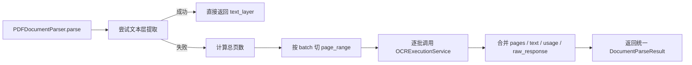

# 02、PDF OCR分批调用优化PRD

## 1. 文档目标

本文用于明确当前 `ai-center` 仓库如何把 `PDF` 的 OCR 调用方式，从“整份 PDF 一次请求”升级为“按页分批请求，再在应用侧组装结果”。

本文重点回答以下问题：

- 当前 `PDF` 解析链路是如何工作的
- 当前方案为什么在大 PDF / 扫描 PDF 场景下不够稳
- 为什么建议采用“分批 OCR”，以及为什么默认建议 `10` 页一批
- 应该如何设计配置、服务边界、批次组装和错误处理
- 哪些 provider 可以直接复用，哪些 provider 需要额外适配
- 分阶段实施顺序与验收标准是什么

本文不是 OCR provider 对接文档，也不是具体代码实现说明，而是面向当前仓库的产品与技术方案文档。

---

## 2. 当前现状

### 2.1 当前 PDF 解析主链路

当前 PDF 入库与解析链路如下：

```text
DocumentChunkService.parse_and_chunk
-> DocumentParseService.parse
-> PDFDocumentParser.parse
-> 先尝试提取 PDF 文本层
-> 提取失败时再调用 OCRExecutionService.extract_text
-> OCR provider adapter
```

当前对应实现：

- 文档解析入口：`app/modules/document_center/services/document_parse_service.py`
- PDF 解析器：`app/modules/document_center/parsers/pdf_parser.py`
- OCR 执行服务：`app/modules/document_center/services/ocr_execution_service.py`
- OCR provider 适配器：
  - `app/integrations/ocr_providers/aliyun_ocr_adapter.py`
  - `app/integrations/ocr_providers/internal_ocr_adapter.py`

### 2.2 当前 PDF 处理策略

当前 `PDFDocumentParser.parse()` 的逻辑是：

1. 先尝试从 PDF 流中提取文本层
2. 如果提取到文本，则直接返回 `strategy=text_layer`
3. 如果提取不到文本，则调用 OCR，返回 `strategy=ocr`

结论：

- 不是所有 PDF 都走 OCR
- 只有“文本层抽取失败”的 PDF 才走 OCR
- 当前 OCR 路径下一次会把整份 PDF 发给 provider

### 2.3 当前 OCR 请求粒度

当前实现中，`AliyunOCRAdapter` 和 `BaseOCRProviderAdapter.build_source_payload()` 的行为是：

- `file_path`：把整份文件读取为 `base64`
- `url`：直接传文件 URL
- `base64`：直接透传
- `page_range`：可以附带在请求中

但当前 `PDFDocumentParser` 只在 OCR 路径里发起一次请求，不会自动按页或按批次拆分。

### 2.4 当前问题

当前整份 PDF 一次 OCR 请求，在以下场景容易暴露问题：

- 扫描版大 PDF 单次请求体过大
- OCR 服务端处理耗时过长，超时概率升高
- 任意一页异常会拖垮整份文档 OCR
- 失败时只能整份重试
- 无法细粒度并发
- 对延迟、成本和失败定位都不够友好

---

## 3. 方案结论

### 3.1 总体结论

建议把 PDF OCR 路径改为：

- 小 PDF：保留整份一次请求
- 大 PDF：按页分批请求 OCR
- 应用侧对批次结果进行有序合并，输出统一的 `DocumentParseResult`

### 3.2 默认批次大小

建议默认值为：

```text
10 页 / 批
```

但不建议硬编码在业务逻辑中，而应做成配置。

### 3.3 为什么不是“永远 10 页一批”

因为合适的批次大小取决于：

- OCR 服务的请求大小限制
- 单页图像分辨率
- 是否启用 layout / seal recognition
- PDF 总页数
- 网络与超时配置
- provider 的吞吐能力

因此结论是：

- `10` 页可以作为默认建议值
- 但应允许通过配置调整为 `5 / 20 / 30`

---

## 4. 为什么建议分批 OCR

### 4.1 稳定性更好

当整份 PDF 一次请求时：

- 一次失败就是整份失败
- 失败重试成本高

改为分批后：

- 可以只重试失败 batch
- 单批失败不会直接导致前面成功结果失效

### 4.2 性能与超时更可控

单批页数变小后：

- 请求体更小
- provider 处理时长更可控
- 更容易把超时配置调准

### 4.3 更适合并发

分批后可以控制一定程度的并发，例如：

- 2 个 batch 并发
- 4 个 batch 并发

从而在可控范围内提高整体吞吐。

### 4.4 更方便观测与计费分析

分批后可以更清晰记录：

- 每个 batch 的页码范围
- 每个 batch 的耗时
- 每个 batch 的 provider 错误
- 每个 batch 的 token / usage

这对 LangSmith tracing 和后续成本分析都更有价值。

---

## 5. 目标方案

### 5.1 目标链路

目标链路如下：



### 5.2 核心设计原则

- 不改变上层 `DocumentParseService.parse()` 的调用方式
- 不改变 `DocumentParseResult` 作为统一输出模型
- OCR 分批只发生在 PDF 且走 OCR 的路径
- 文本层可直接提取的 PDF 仍沿用当前轻量路径
- 默认先利用 `page_range` 做逻辑分页，不优先引入“物理拆 PDF 文件”

---

## 6. 分批策略设计

### 6.1 触发条件

只有同时满足以下条件时才启用分批 OCR：

1. 文件类型为 `pdf`
2. PDF 文本层提取失败
3. OCR 分批开关已开启
4. 页数超过阈值

### 6.2 默认策略

建议默认策略：

- `page_count <= 10`：整份一次请求
- `page_count > 10`：按 `10` 页一批

举例：

- 8 页 PDF：1 次请求
- 23 页 PDF：3 次请求，页段为 `1-10`、`11-20`、`21-23`

### 6.3 可配置参数

建议新增以下配置：

```env
OCR_PDF_BATCH_ENABLED=true
OCR_PDF_BATCH_PAGES=10
OCR_PDF_BATCH_MIN_TOTAL_PAGES=11
OCR_PDF_BATCH_MAX_CONCURRENCY=2
OCR_PDF_BATCH_FAIL_FAST=true
```

含义：

- `OCR_PDF_BATCH_ENABLED`
  是否启用 PDF OCR 分批
- `OCR_PDF_BATCH_PAGES`
  每批页数
- `OCR_PDF_BATCH_MIN_TOTAL_PAGES`
  总页数至少达到多少时才启用分批
- `OCR_PDF_BATCH_MAX_CONCURRENCY`
  允许的最大并发批次数
- `OCR_PDF_BATCH_FAIL_FAST`
  某个 batch 失败时是否立即中断整份 PDF 解析

### 6.4 为什么优先使用 page_range

当前统一 OCR 请求模型里已经有 `page_range` 字段，因此优先建议：

- 使用原始 PDF
- 每次只指定一个 `page_range`
- 由 provider 处理对应页

这样比“先在本地物理拆 PDF，再逐个子文件上传”更简单，原因是：

- 不需要引入 PDF 切片依赖
- 不需要维护中间临时文件
- 调用链更短
- 失败排查更直观

只有当某个 provider 不支持 `page_range` 或者 `page_range` 效果不稳定时，再考虑物理拆分 PDF 文件。

---

## 7. 返回结果如何组装

### 7.1 组装目标

上层不应该感知“这是一次 OCR 请求”还是“多次 OCR 请求”。

也就是说，无论单次还是分批，最终都应统一返回：

- `text`
- `pages`
- `locations`
- `metadata`
- `provider`
- `model`
- `raw_response`

### 7.2 text 组装

建议按页码顺序拼接：

```text
page1_text + "\n\n" + page2_text + "\n\n" + ...
```

### 7.3 pages 组装

建议将所有 batch 返回的 `OCRPage` 展平后，按 `page_no` 升序合并。

要求：

- 页码必须保真
- 不允许因批次重排而打乱页序
- 如果 provider 未返回页码，应用侧按 batch 内相对顺序推导

### 7.4 usage 组装

建议规则：

- 数值型 usage 字段做求和
- 非数值型字段做保留或列表聚合

例如：

- `total_pages`
- `request_count`
- `input_tokens`
- `output_tokens`

都应支持合并统计。

### 7.5 raw_response 组装

建议不要只保留最后一个 batch 的原始响应，而应保留：

```json
{
  "mode": "batched_ocr",
  "batch_size": 10,
  "batches": [
    {
      "batch_index": 0,
      "page_range": [1,2,3,4,5,6,7,8,9,10],
      "raw_response": {}
    }
  ]
}
```

这样后续：

- 出问题时便于排查
- LangSmith trace 中也能更好展示批次信息

---

## 8. provider 兼容性要求

### 8.1 Aliyun OCR

当前 Aliyun 适配器复用了通用 `build_source_payload()`，因此请求中可以携带：

- `file_base64` 或 `file_url`
- `page_range`

这意味着：

- 从应用层视角，Aliyun 路径可以直接尝试做“按 page_range 分批请求”

### 8.2 Internal OCR

当前内部 OCR 适配器 `_build_layout_parsing_payload()` 并没有把 `page_range` 显式传给下游服务。

这意味着：

- 如果后续要统一支持 PDF 分批 OCR
- 内部 OCR 适配器也需要同步补齐 `page_range` 能力

### 8.3 provider 能力抽象

建议后续显式引入 provider 能力声明，例如：

- `supports_pdf_page_range`
- `supports_pdf_url_input`
- `supports_pdf_base64_input`

这样 `PDFDocumentParser` 在选择分批策略时可以更明确：

- 能用 `page_range` 就直接按页段请求
- 不能用 `page_range` 时再考虑 fallback 策略

---

## 9. 目录与代码落位建议

### 9.1 主要改动文件

建议主要改动以下文件：

- `app/core/config.py`
- `app/modules/document_center/parsers/pdf_parser.py`
- `app/modules/document_center/services/ocr_execution_service.py`
- `app/integrations/ocr_providers/internal_ocr_adapter.py`

### 9.2 可新增的辅助模块

建议新增：

- `app/modules/document_center/services/pdf_ocr_batching_service.py`

职责：

- 计算总页数
- 生成批次 `page_range`
- 调用 OCR 执行服务
- 合并结果

这样可以避免把 `pdf_parser.py` 塞得过重。

### 9.3 为什么不直接把逻辑都写进 PDFDocumentParser

因为分批 OCR 逻辑会逐渐变复杂，涉及：

- 批次计算
- 并发
- 重试
- usage 汇总
- raw_response 聚合

这些逻辑继续堆进 `PDFDocumentParser`，会让 parser 从“格式解析器”变成“批处理编排器”，职责会失衡。

---

## 10. 错误处理与重试策略

### 10.1 fail-fast 模式

默认建议先采用：

- 任意 batch 失败则整份 PDF 解析失败

原因：

- 行为清晰
- 上层不需要处理“部分页面成功，部分页面失败”
- 更适合最小可用版本

### 10.2 后续可扩展的容错模式

后续可以再考虑支持：

- 失败 batch 自动重试 1 到 2 次
- 失败页保留占位文本
- 输出部分成功结果并标记缺页

但这些都不建议放在第一版。

### 10.3 trace 与日志要求

每个 batch 至少应记录：

- `batch_index`
- `page_range`
- `provider`
- `latency_ms`
- `status`
- `error_code`

这样后续在 LangSmith 或日志里才能看到：

- 哪一批失败
- 哪一批最慢
- 总共发了几次 OCR 请求

---

## 11. 观测与评测要求

### 11.1 tracing

接入 LangSmith 后，建议在 OCR 分批场景中形成如下链路：

```text
document.parse_and_chunk
-> document.parse
-> pdf.parse
-> pdf.ocr.batch[0]
-> pdf.ocr.batch[1]
-> ...
```

### 11.2 metrics

建议补充这些基础指标：

- `pdf_ocr_batch_count`
- `pdf_ocr_total_pages`
- `pdf_ocr_batch_latency_ms`
- `pdf_ocr_failed_batch_count`

### 11.3 评测

后续可以专门建立一批大 PDF / 扫描 PDF 样本，比较：

- 单次整份 OCR
- 分批 OCR

在以下维度上的差异：

- 成功率
- 总耗时
- 平均批次耗时
- 内容完整度
- 页码定位准确度

---

## 12. 非目标

本次 PRD 不包括以下内容：

- 不引入新的 OCR provider
- 不立刻做物理拆 PDF 文件
- 不做部分成功部分失败的复杂恢复
- 不做跨文档批处理调度
- 不把所有图片、DOCX、PPTX 统一改成分批 OCR

本次只聚焦：

- PDF
- OCR 路径
- 分批请求
- 结果合并

---

## 13. 分阶段实施建议

### 13.1 第一阶段

先做最小可用版本：

- 增加配置项
- 在 `PDFDocumentParser` 的 OCR 路径启用分批
- 默认顺序执行 batch
- 在应用侧组装统一结果

### 13.2 第二阶段

再做稳定性增强：

- 增加并发控制
- 增加 batch 重试
- 补充内部 OCR 的 `page_range` 支持
- 补 tracing 和 metrics

### 13.3 第三阶段

最后做策略优化：

- 动态调整 batch size
- 基于 provider 能力自动选路
- 加入更完整的离线评测

---

## 14. 验收标准

### 14.1 功能验收

- 当 PDF 文本层提取成功时，仍走原有 `text_layer` 流程
- 当 PDF 文本层提取失败且页数不大时，仍可整份 OCR 成功
- 当 PDF 文本层提取失败且页数大于阈值时，按批次调用 OCR
- 最终返回的 `DocumentParseResult.text`、`pages`、`locations` 顺序正确

### 14.2 稳定性验收

- 50 页以上扫描 PDF 的解析成功率高于当前整份单次请求方案
- 单个 batch 失败时能够明确定位到失败页段
- 失败信息能够进入 trace / 日志

### 14.3 兼容性验收

- 不影响现有 DOCX / XLSX / PPTX / image 的解析路径
- 不改变 `DocumentParseService.parse()` 的对外接口
- 不影响现有 `KnowledgeIndexService` 入库调用方式

---

## 15. 结论

结合当前仓库实现，最合理的方向不是把所有 PDF 都强行改成一页一请求，而是：

- 保留文本层优先
- OCR 路径下对大 PDF 采用分批调用
- 默认建议 `10` 页一批
- 通过配置控制是否启用、批次大小和并发度
- 由应用侧统一合并返回结果

这样能在不破坏现有上层接口的前提下，明显提升大 PDF / 扫描 PDF 的：

- 成功率
- 可重试性
- 可观测性
- 后续扩展空间
