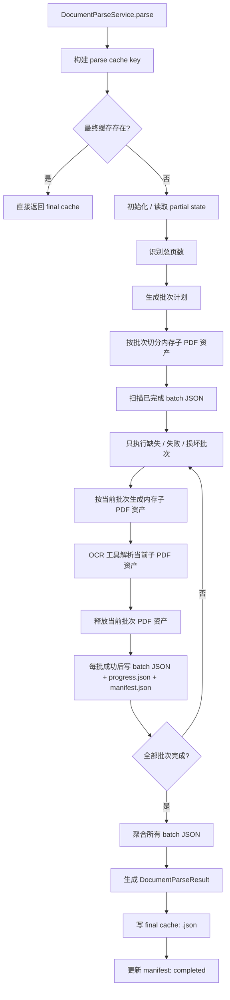

# 03、PDF OCR分批缓存与断点续传PRD

## 1. 文档目标

本文用于明确当前 `ai-center` 仓库中 `PDF OCR` 解析链路的下一阶段优化方案，将现有“整次 OCR 调用 + 整次成功后写单个缓存文件”的模式，升级为“service 层按批次切分内存子 PDF 资产 + 分批 OCR + 分批写入 JSON checkpoint + 支持断点续传”的模式。

本文重点回答以下问题：

- 为什么当前 PDF OCR 方案在大附件场景下不够稳
- 为什么需要把 OCR 结果按批次落到本地 JSON，而不是只保留最终聚合结果
- 中断后如何根据已完成批次继续执行，而不是整份 PDF 从头再跑
- 当 OCR 工具不支持 `page_range` 时，如何设计一套可落地的批处理方案
- 为什么批次切分应该放在 service 层，而不是放在 OCR 工具层
- 新增哪些目录、配置、状态文件、服务边界和验收标准

本文是产品与技术一体化 PRD，不是具体代码实现说明。

---

## 2. 背景与现状

### 2.1 当前 PDF 解析链路

当前 PDF 入库与解析主链路如下：

```text
DocumentChunkService.parse_and_chunk
-> DocumentParseService.parse
-> PDFDocumentParser.parse
-> 先尝试 PDF 文本层提取
-> 文本层失败时调用 OCRExecutionService.extract_text
-> OCR provider adapter
-> 返回统一 DocumentParseResult
```

对应主要实现：

- `app/modules/document_center/services/document_parse_service.py`
- `app/modules/document_center/parsers/pdf_parser.py`
- `app/modules/document_center/services/ocr_execution_service.py`
- `app/modules/document_center/services/pdf_ocr_batching_service.py`
- `app/integrations/ocr_providers/internal_ocr_adapter.py`

### 2.2 当前缓存方式

当前 `document_parse_cache` 的缓存方式是：

- 按整次解析请求生成 `cache_key`
- 最终结果只落一个 JSON 文件：
  - `data/document_parse_cache/<cache_key>.json`
- 只有当整次解析成功后，才会写入这个最终缓存

当前没有这些能力：

- 没有批次级缓存文件
- 没有进行中的任务状态文件
- 没有“已完成第几批”的持久化 checkpoint
- 没有“聚合前中断后只重做剩余批次”的能力

### 2.3 当前批处理能力的边界

当前代码中已经有 `PDFOCRBatchingService`，但它主要解决的是“按批量调用 OCR”和“批次内重试”，并没有解决下面这几个问题：

- OCR 工具不支持 `page_range`
- 多次传递整份 PDF 成本过高
- 批次结果缺少持久化 checkpoint
- 进程中断后无法接着上次结果继续跑

### 2.4 当前问题

在大 PDF、扫描 PDF、网络不稳定或 OCR 服务偶发失败的场景下，当前方案有这些问题：

- 用户看不到当前解析进度
- 任意时刻中断，前面已成功的 OCR 结果会丢失
- 整份 PDF 失败后只能整份重跑
- 无法快速判断卡在哪个批次
- 如果 OCR 工具不支持 `page_range`，则无法只处理指定页段
- 如果每个批次都重新上传整份 PDF，则网络和服务端成本都不合理

---

## 3. 方案结论

### 3.1 总体结论

当 OCR 工具不支持 `page_range`，且不希望每个批次都重复传整份 PDF 时，建议采用方案 B：

1. 由 service 层先识别 PDF 总页数并制定批次计划
2. 由 service 层将原始 PDF 按批次切分为多个内存子 PDF 资产
3. 每个子 PDF 资产只包含当前批次页段，且只在当前批次执行期间存在
4. OCR 工具只处理“当前这一个批次 PDF 资产”
5. 每个批次成功后立即落本地 JSON checkpoint
6. 下次同一请求再次执行时，优先复用已完成批次
7. 全部批次完成后，再聚合生成完整 `DocumentParseResult`

### 3.2 为什么选择方案 B

与“每批都传整份 PDF”相比，方案 B 的优点是：

- OCR 工具不需要支持 `page_range`
- 单次请求体更小，失败隔离更好
- 中断后只重做剩余子 PDF 批次
- 更容易做本地缓存与断点续传

与“升级 OCR 服务协议、上传一次拿 file_id”相比，方案 B 的优点是：

- 不依赖外部 OCR 服务接口升级
- 可以直接在当前仓库内落地
- service 层可完全掌控批次生命周期

### 3.3 本次方案的关键原则

- 不改变上层 `DocumentParseService.parse()` 的调用方式
- 不改变上层最终返回 `DocumentParseResult` 的统一结构
- OCR 工具层不感知整份 PDF 的页数、批次计划和续传状态
- 批次切分、进度、checkpoint、续传全部由 service 层负责
- 子 PDF 资产是 service 层的临时中间产物，不暴露给上层业务，也不作为断点续传持久化对象

---

## 4. 目标与非目标

### 4.1 目标

- 为 PDF OCR 建立批次级 JSON 存储
- 为 PDF OCR 建立断点续传机制
- 为长 PDF 提供可见的解析进度
- 在不依赖 `page_range` 的前提下实现稳定的批次处理
- 明确 service 层与 OCR 工具层的职责边界

### 4.2 非目标

- 不改造非 PDF 文件的解析缓存
- 不改造文本层提取成功的 PDF 路径
- 不要求 OCR 工具理解整份 PDF 的页码与进度
- 不在本期做 OCR provider 异步队列化
- 不在本期实现“上传一次、服务端 file_id 多次复用”的 provider 协议升级

---

## 5. 目标流程

目标流程如下：



---

## 6. 核心架构设计

### 6.1 职责边界

建议明确拆成三层职责：

`PDFDocumentParser / PDFOCRBatchingService`

- 识别 PDF 总页数
- 生成批次计划
- 切分子 PDF
- 读取和写入 partial 状态
- 控制批次执行顺序
- 做断点续传
- 聚合最终结果

`OCRExecutionService`

- 接收“当前批次子 PDF”的解析请求
- 调用具体 OCR provider
- 不关心整份 PDF 有多少页
- 不关心是否为第几批

`OCR Provider Adapter`

- 只做协议转换
- 只解析当前批次输入文件
- 只返回当前批次的 `OCRProviderResponse`

### 6.2 设计结论

本次方案的核心不是把“批处理逻辑”塞进 OCR 工具，而是把批处理逻辑上移到 service 层。

也就是说：

- OCR 工具是“单次执行器”
- service 层是“批次编排器”

---

## 7. 批次 PDF 资产设计

### 7.1 批次 PDF 资产的定位

批次 PDF 资产是 service 层生成的临时中间产物，每个资产只包含一个批次对应的页段。

例如 23 页 PDF，按 10 页一批时，生成：

```text
batch 1 -> pages 1-10
batch 2 -> pages 11-20
batch 3 -> pages 21-23
```

### 7.2 批次 PDF 资产的作用

批次 PDF 资产的作用不是给上层业务使用，而是给 OCR 工具提供“最小必要输入”。

这样 OCR 工具收到的永远只是：

- 一个文件
- 这个文件里只有当前批次页段

因此 OCR 工具不需要理解：

- 原始 PDF 总页数
- 批次大小
- 当前第几批
- 断点续传状态

### 7.3 批次 PDF 资产生命周期

批次 PDF 资产不作为持久化文件保存，而是在当前批次调用 OCR 前即时生成，OCR 调用完成后立即释放。

建议实现方式：

- 在 service 层内存中生成批次 PDF bytes
- 传给 OCRExecutionService 时转为 `base64` 资产
- OCR 请求结束后不再保留该批次 PDF 资产
- 如果进程异常退出，不需要额外回收中间 PDF 文件

### 7.4 为什么不保存批次 PDF 资产

原因如下：

- 断点续传真正需要保留的是“已完成批次结果”，不是“待执行输入切片”
- 批次 PDF 可由原始 PDF 按批次计划再次即时生成
- 保留中间 PDF 文件会增加磁盘占用和目录复杂度
- 对恢复来说，重切一个未完成批次的 PDF 资产成本远低于重做 OCR

---

## 8. 存储设计

### 8.1 目录结构

建议在现有最终缓存文件之外，新增一个 partial 工作目录：

```text
data/document_parse_cache/
├── <cache_key>.json
└── <cache_key>.partial/
    ├── manifest.json
    ├── progress.json
    └── batches/
        ├── batch-0001-pages-1-10.json
        └── batch-0002-pages-11-20.json
```

### 8.2 manifest.json

`manifest.json` 用于描述这次解析任务的静态计划和整体状态，建议至少包含：

```json
{
  "cache_key": "sha256...",
  "state": "running",
  "parser_name": "pdf_document_parser",
  "parser_version": "v3",
  "provider": "internal_ocr",
  "file_name": "sample.pdf",
  "file_type": "pdf",
  "asset_hash": "sha256...",
  "batch_size": 10,
  "batch_count": 3,
  "completed_batch_count": 1,
  "created_at": "2026-03-26T12:00:00+08:00",
  "updated_at": "2026-03-26T12:02:00+08:00",
  "batches": [
    {
      "batch_index": 1,
      "page_range": [1,2,3,4,5,6,7,8,9,10],
      "output_file": "batches/batch-0001-pages-1-10.json",
      "status": "completed",
      "attempt_count": 1,
      "error_code": null
    },
    {
      "batch_index": 2,
      "page_range": [11,12,13,14,15,16,17,18,19,20],
      "output_file": "batches/batch-0002-pages-11-20.json",
      "status": "pending",
      "attempt_count": 0,
      "error_code": null
    }
  ]
}
```

### 8.3 progress.json

`progress.json` 用于给脚本、控制台、后续 API 查询直接读取当前进度，建议包含：

```json
{
  "state": "running",
  "total_batches": 8,
  "completed_batches": 3,
  "failed_batches": 0,
  "current_batch_index": 4,
  "current_page_range": [31,32,33,34,35,36,37,38,39,40],
  "percent": 37.5,
  "updated_at": "2026-03-26T12:03:12+08:00"
}
```

### 8.4 batch JSON 结构

每个批次成功后应立即写入一个批次 JSON，建议结构如下：

```json
{
  "batch_index": 2,
  "page_range": [11,12,13,14,15,16,17,18,19,20],
  "provider": "internal_ocr",
  "model": "paddleocr_vl_layout_parsing",
  "attempt_count": 1,
  "started_at": "2026-03-26T12:01:20+08:00",
  "finished_at": "2026-03-26T12:01:46+08:00",
  "pages": [
    {
      "page_no": 1,
      "text": "..."
    }
  ],
  "text": "...",
  "usage": {},
  "raw_response": {}
}
```

注意：

- `pages.page_no` 可以是批次内相对页码
- service 层在聚合时负责把它映射回原始 PDF 页码
- 这也是为什么“批次页码映射”必须由 service 层掌控，而不是丢给 OCR 工具
- 中间 PDF 资产路径或 bytes 不写入长期 checkpoint

---

## 9. 断点续传设计

### 9.1 续传前提

只有在以下条件全部一致时，才允许复用已有批次：

- `asset_hash` 一致
- `parser_name` 一致
- `parser_version` 一致
- `provider` 一致
- `batch_size` 一致
- 批次计划一致

只要其中任一关键条件变化，就必须放弃旧的 partial 状态，按新计划重新开始。

### 9.2 续传规则

下次同一请求再次执行时，系统应按以下顺序处理：

1. 如果最终缓存 `<cache_key>.json` 已存在，直接返回
2. 如果最终缓存不存在，但 partial 目录存在：
   - 读取 `manifest.json`
   - 扫描 `batches/*.json`
   - 将有效批次标记为 completed
   - 只重跑缺失、失败或损坏批次
3. 如果所有批次都已完成但最终缓存还未生成：
   - 直接做聚合
   - 不重复调用 OCR

### 9.3 中断场景

以下中断场景都必须支持恢复：

- 用户手动停止脚本
- Python 进程退出
- OCR 某个批次重试后仍失败
- 聚合前崩溃
- 写最终缓存前崩溃

恢复要求：

- 已成功 batch 不重复 OCR
- 未完成 batch 需要时再即时重建当前批次 PDF 资产
- 失败 batch 仅重做失败部分
- 聚合阶段中断后，下次优先读取已成功 batch JSON 聚合

### 9.4 损坏处理

如果发现以下情况，应只重跑受影响批次，而不是整份重跑：

- `batch JSON` 无法反序列化
- `pages` 为空
- `page_range` 与 manifest 不匹配
- `provider` 与 manifest 不匹配

---

## 10. internal_ocr 兼容性要求

### 10.1 核心要求

由于本次方案采用“service 层切分批次 PDF 资产”，因此 `internal_ocr` 不再被要求支持 `page_range`。

`internal_ocr` 的要求收敛为：

1. 能稳定处理单个批次 PDF 资产
2. 对同类批次 PDF 资产返回稳定结构
3. 批次内返回的页顺序与该批次 PDF 内页顺序一致

### 10.2 设计收益

这样做之后：

- 不需要依赖 `internal_ocr` 是否真正尊重 `pageRange`
- 不需要每次都把整份 PDF 重新传给 OCR
- `internal_ocr` 只需把当前批次 PDF 资产当作普通 PDF 处理

### 10.3 service 层责任

由于 `internal_ocr` 不再理解原始大 PDF 的全局页码，因此这些工作必须由 service 层完成：

- 原始页码到批次页码的映射
- 批次内相对页号回写成原始页号
- 临时批次 PDF 资产与原始文档的关联关系维护

---

## 11. 服务边界设计

### 11.1 建议新增能力

建议在当前文档解析模块中新增两层能力：

```text
ParseCacheService
-> 负责最终完整 DocumentParseResult 缓存

PDFOCRCheckpointService
-> 负责 partial manifest / progress / batch JSON

PDFBatchAssetService
-> 负责按页切分原始 PDF，生成批次子 PDF

PDFOCRBatchingService
-> 负责批次计划、恢复、执行、聚合
```

### 11.2 职责划分

`ParseCacheService`

- 保持现有最终缓存职责
- 不感知批次级中间状态

`PDFOCRCheckpointService`

- 创建 partial 目录
- 读写 `manifest.json`
- 读写 `progress.json`
- 读写 `batches/*.json`
- 校验 batch JSON 是否可复用

`PDFBatchAssetService`

- 识别 PDF 页数
- 切分子 PDF
- 返回当前批次临时子 PDF 路径与页段映射

`PDFOCRBatchingService`

- 制定批次计划
- 判断哪些批次可复用
- 为缺失批次即时生成子 PDF
- 调用 OCR
- 在每批成功后写 checkpoint
- 在全部完成后聚合并返回统一结果

---

## 12. 配置设计

建议在现有 OCR 配置基础上新增或明确以下配置：

```env
OCR_PDF_BATCH_ENABLED=true
OCR_PDF_BATCH_PAGES=10
OCR_PDF_BATCH_MIN_TOTAL_PAGES=11
OCR_PDF_BATCH_MAX_RETRIES=1
OCR_PDF_BATCH_RETRY_DELAY_MS=500
OCR_PDF_BATCH_RESUME_ENABLED=true
OCR_PDF_BATCH_CACHE_KEEP_PARTIAL=true
OCR_PDF_BATCH_PROGRESS_ENABLED=true
```

含义说明：

- `OCR_PDF_BATCH_RESUME_ENABLED`
  是否启用断点续传
- `OCR_PDF_BATCH_CACHE_KEEP_PARTIAL`
  最终成功后是否保留 partial 目录
- `OCR_PDF_BATCH_PROGRESS_ENABLED`
  是否持续写出 `progress.json`

---

## 13. 可观测性与进度输出

### 13.1 本地进度

当脚本或服务正在解析大 PDF 时，应至少能读取到以下进度信息：

- 总批次数
- 已完成批次数
- 当前执行批次
- 当前页段
- 最近更新时间

后续 `scripts/smoke_rag.py` 或 API 层可以直接读取 `progress.json` 并展示：

```text
PDF OCR progress: 3/8 batches completed, current=4 (pages 31-40)
```

### 13.2 LangSmith

现有 `pdf.ocr` / `pdf.ocr.batch` tracing 需要继续保留，并补充以下 metadata：

- `resume_enabled`
- `resumed_batch_count`
- `skipped_batch_count`
- `checkpoint_hit`
- `checkpoint_dir`
- `batch_page_range`

这样可以区分：

- 首次完整执行
- 中断后恢复执行
- 纯聚合恢复

---

## 14. 验收标准

### 14.1 批次缓存

- 20 页 PDF 首次解析后，必须在 `data/document_parse_cache/<cache_key>.partial/` 下看到：
  - `manifest.json`
  - `progress.json`
  - 2 个 batch JSON

### 14.2 断点续传

- 30 页 PDF 解析到第 2 批后手动中断
- 再次发起同一请求时：
  - 第 1、2 批必须直接复用
  - 只执行剩余批次
  - 最终结果成功聚合

### 14.3 OCR 工具边界

- OCR 工具收到的始终是单个批次 PDF 资产
- OCR 工具不需要知道原始 PDF 总页数
- OCR 工具不需要知道断点续传状态
- OCR 完成后中间 PDF 资产不应落盘保存

### 14.4 最终缓存

- 所有批次完成后，必须成功写出最终 `<cache_key>.json`
- 如果最终缓存写入前中断，下次执行必须能直接从 batch JSON 聚合完成

---

## 15. 风险与注意事项

### 15.1 批次 PDF 资产依赖

本方案的关键前提，是服务层必须具备稳定的 PDF 分页切分能力和内存资产构造能力。

因此需要补齐：

- PDF 页数识别
- 批次 PDF 生成
- base64 资产构造

### 15.2 内存占用

虽然中间 PDF 不持久化到磁盘，但运行中仍会产生额外内存占用，因此要考虑：

- 单批次 PDF bytes 的峰值大小
- base64 编码带来的体积膨胀
- 避免一次性同时构造过多批次资产

### 15.3 原子写与锁

为了避免两个进程同时处理同一份 PDF，仍需保留现有 parse 级锁，并确保：

- `manifest.json`
- `progress.json`
- `batch JSON`
- 最终缓存 JSON

都采用原子写或安全替换策略。中间 PDF 资产不参与持久化写入。

### 15.4 parser version

由于本次缓存模型发生变化，建议将相关 parser / checkpoint 版本升级，例如：

- `PDFDocumentParser.parser_version = "v3"`

以避免旧缓存与新断点续传状态混用。

---

## 16. 实施建议

建议分两步落地：

### 阶段一

- 建立 partial 目录结构
- 建立 manifest / progress / batch JSON
- 建立批次 PDF 资产切分能力
- 建立批次内存资产生命周期管理
- 建立断点续传

### 阶段二

- 对 `smoke_rag.py` 增加解析进度输出
- 对 LangSmith 补充 resume 相关 metadata
- 增加清理策略、损坏恢复策略和更多回归测试

---

## 17. 本文结论

当前 PDF OCR 优化的核心，不是单纯把“一次请求”改成“多次请求”，而是把 OCR 解析过程升级为一套可恢复、可观察、可复用的执行模型。

在 OCR 工具不支持 `page_range` 的前提下，本次 PRD 选择的方案是：

- 由 service 层按批次切分批次 PDF 资产
- 批次 PDF 资产仅在当前批次执行期间存在
- OCR 工具只解析当前批次 PDF 资产
- 每批成功立即落 JSON checkpoint
- 中断后从已完成批次恢复
- 最终再聚合为完整解析结果

只有同时满足这五点，这次优化才算真正完成。
